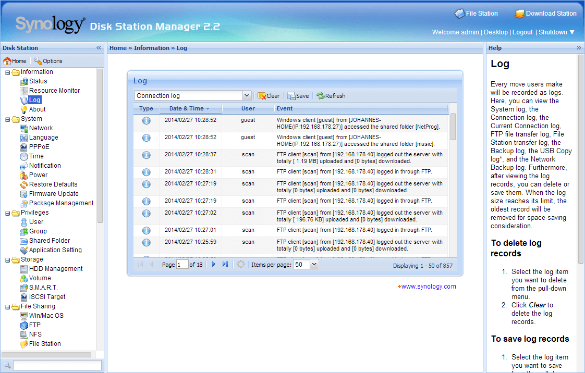

# Ext JS Kochbuch - Kapitel 1: Quickstart

<a name="toc"></a>
##### Inhalt  
1. [Willkommen](#willkommen)
2. [Frameworks](#frameworks)
3. [Hello World](#hello)

<hr>

<a name="willkommen"></a>
# 1. Willkommen

Willkommen zum kleinen Ext JS (und Ext.NET) Kochbuch.
Dieses Dokument soll als detailiertere Erläuterung zum Ext JS Workshop von Johannes Hoppe dienen. Bitte beachten Sie, dass es nicht als ausführliches Nachschlagewerk gedacht ist. Die hier vorgestellten Themen sind selektiv ausgewählt. Ziel ist es, einen schnellen, aber fundierten, Einstieg in Ext JS bzw. Ext.NET zu bieten. Folgende Resourcen und Bücher werden eine gute Ergänzung sein:

1. Die sehr ausführliche [Ext JS Dokumentation](../extjs/docs/index.html) *(wird im gesamten Kochbuch als Mirror verlinkt)*
2. Das Buch "[Ext JS 4 Web Application Development Cookbook](http://www.packtpub.com/sencha-ext-js-4-web-application-development-cookbook/book)" von Stuart Ashworth & Andrew Duncan
3. Das Buch "[Ext.NET Web Application Development](http://www.packtpub.com/extnet-web-application-development/book)" von Anup Shah

 

<a name="frameworks"></a>
# 2. Frameworks

### Ext JS

**Ext JS** ist ein "alles in einem" Framework von Senscha. Bis zur (mitlerweile historischen) Version 1 war Ext JS als Erweiterung von YUI, jQuery oder Prototype/Script.aculo.us konzipiert. Seit Version1.1 hat Ext JS keine externen Abhängigkeiten zu anderen Standardbibliotheken mehr, sondern bringt Funktionalitäten wie DOM-Manipulaton, AJAX oder ein Klassen-System bereits mit. Eine friedliche Koexistenz mit anderen Standardbibliotheken ist weiterhin problemlos möglich.

"Leichtgewichtige Frameworks" haben Ihren Fokus darauf, möglichst wenig Dinge besonders gut zu lösen und andere Aspekte nicht zu berücksichtigen. Hier ist es in der Aufgabe der Entwickler, weitere Frameworks zu kombinieren. jQuery konzentriert sich etwa stark auf die DOM-Manipulation sowie AJAX und macht keine Vorgaben zur Gestaltung vom verwendeten HTML oder CSS. Viele jQuery-Entwickler rüsten in diesem Sinne fehlende Funktionalität mit Plugins nach, verwenden den Modul-Loader [require.js](http://requirejs.org/) und/oder ergänzen dies mit dem CSS-Framework wie [Bootstrap](http://getbootstrap.com/). 

Ext JS hingegen konzentriert sich auf komplexe Web-Anwendungen und ist definitiv nicht "leichtgewichtig". Das Ext JS Framework deckt viele Funktionalitäten intern ab, so dass kaum weitere Frameworks notwendig sein werden. Der Abstraktionsgrad ist extrem hoch, das Arbeiten am Browser-DOM ist nur für spezielle Fälle notwendig. Statt auf der Basis von HTML zu entwickeln, wird Ext JS mit einer enormen Anzahl an so genannten "Widgets" ausgeliefert. Hierzu zählen unter anderem [modale Fenster](../extjs/docs/index.html#!/api/Ext.window.Window), [Charts](../extjs/docs/index.html#!/api/Ext.chart.Chart) oder [Grids](../extjs/docs/index.html#!/api/Ext.grid.Panel). Durch die konsistent gehaltene Usablitity der Widgets haben alle Ext JS Anwendungen ein Verhalten, welches an Desktop-Anwendungen angelehnt ist. Trotz der Möglichkeit von Themes, ist bei allen Ext JS Anwendungen das zu Grunde liegende Framework leicht am Aussehen und Verhalten zu erkennen.

Das starre Gerüst, welches Ext JS vorgibt, kann als sehr einengend angesehen werden. Gerade in geschäftlichem Umfeld oder großen oder verteilten Teams, kann dieses starre Gerüst hingegen gerade der entscheidende Vorteil sein. So ist Ext JS besonders stark im Umfeld in Intranet-Anwendungen (z.B. in der Administrations-Oberfläche der Network Attached Storages (NAS) von Synology) bzw. in geschäftlichen Web-Anwendungen (z.B. im Backend von [Shopware](http://www.shopware.de/)) zu finden.




Die zum Zeitpunkt des Schreibens dieses Dokumentes aktuelle Version ist Ext JS 4.2.1. 

### Ext.NET

**Ext.NET** ist ein Framework, welches Ext JS speziell für ASP.NET Entwickler erweitert. Es liefert streng typisierte Wrapper-Controls sowohl für ASP.NET als auch für ASP.NET MVC (hier jeweils für klassische Views als auch für Razor-Views). Wie bei allen .NET-Klassen stehen durch die Wrapper-Controls automatische Vervollständigung von Quelltext ("IntelliSense") sowie eine Validierung durch den Compiler zur Verfügung. Weiterhin wird Ext.NET als Nuget-Paket angeboten, was die Einbindung in ein ASP.NET Projekt sehr vereinfacht	.

Die zum Zeitpunkt des Schreibens dieses Dokumentes aktuelles Version ist Ext.NET 2.4.0, welches auf Ext JS 4.2.1 basiert.


<a name="hello"></a>
# 3. Hello World

Ohne auf die Details einzugehen, sollte ein Kochbuch mit einem "Hello World"-Beispiel beginnen. Folgendes Beispiel instanziert eine Klasse vom Typ 'Ext.window.Window'.

```javascript
Ext.onReady(function () {
	Ext.create('Ext.window.Window', {
	    title: 'Test',
	    height: 200,
	    width: 400,
		html: "Hello World"
	}).show();
});
```
Das Ergebnis ist ein einfaches Fenster:
<div id="example1"></div>
<script>
Ext.onReady(function () {
	Ext.create('Ext.window.Window', {
	    title: 'Test',
	    height: 200,
	    width: 400,
		html: "Hello World",
		renderTo: 'example1'
	}).show();
});
</script>

Test

<hr>
_&copy; 2014, Johannes Hoppe_